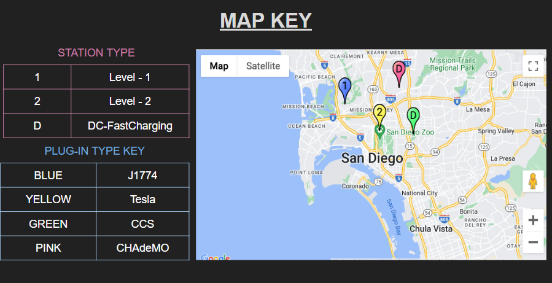
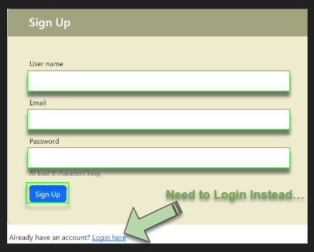
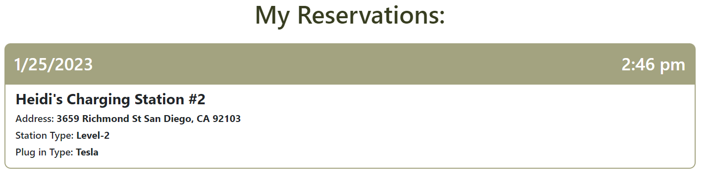
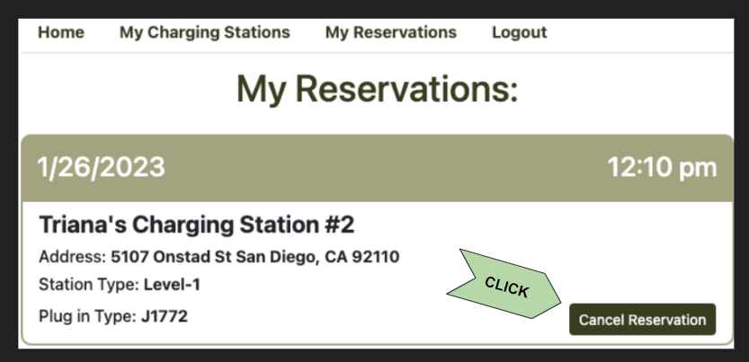

# EV Charge n Go
Project #2

# Project Description
This app  allows owners of private home chargers to rent out their personal EV chargers to others by location, reservations, and duration of use with an owner fixed rate.
 
# Table of Contents
* [User Story](#User-Story)
* [Acceptance Criteria](#Acceptance-Criteria) 
* [Motivation for Development](#Motivation-for-Development) 
* [Process](#Process) 
* [Technology](#Technology) 
* [Challenges](#Challenges) 
* [Successes](#Successes) 
* [Usage](#Usage) 
* [Goals for Future Development](#Goals-for-Future-Development) 
* [Support](#Support) 
* [Deployed Site](#Deploye-Site) 
* [Tasks and Roles](#Tasks-and-Roles) 
* [Credits and Contributors](#Credits-and-Contributors)

# User-Story 
- AS A developer who is interested in supporting Californias initiative towards more electric vehicles
- I WANT an EV Charge N Go site to support the efforts in reducing gas emmissions and increasing electric vehicle use 
- SO THAT more individuals can have access to owning or using an electric car regardless of installing a home charger themselves or needing to own a home to access 
- AND SO THAT while traveling out of town, finding stations to reserve in advance to ensure the ability of electric vehicle use 

# Acceptance Criteria
- GIVEN a EV Charge N Go Site
- WHEN I visit the site for the first time
- THEN I am presented on a homepage, landing site, which includes a map and a zip code search form
- WHEN I enter my zip code
- THEN I am prompted to sign up or login in
- WHEN I sign up 
- THEN I must provide a valid email address and password
- WHEN I am done signing up
- THEN I am automatically directed to the home page
- WHEN I already have an account
- THEN I can login using an email and password
- WHEN I am logged in and my username appears on the top left side of the home page
- THEN I can select either to view My Charging Stations, My Reservation, search for a station via a zipcode, or add a charging station (+ Station)
- WHEN I want to make a modification to My Reservations
- THEN select Cancel Reservation to remove from que
- WHEN I add a charging station
- THEN I have to fill out the station form with station name, station address, station type, and plug in types
- WHEN I go to My Charging Stations
- THEN all the charging stations I own will appear in one page
- WHEN I want to make a reservation
- THEN I have to search for a station and click on reserve to get redirected to fill out the reservation form with date and time of reservation
- WHEN the reservation is made
- THEN in My Reservations detail station information, along with date and time of reservation will appear
- WHEN I select Logout 
- THEN I am logged out of the site

# Motivation for Development
- We all came to an agreement that EV Charging isnt easily accessible and a gap for EV owners and station owners exists. This application allows personal station owners to advertise their stations for reservations and in parallel supporting EV ease of access initiative to a wider range of the community for ease of access supporting EV's future mission.  

# Process
- Topic / Project defined
- Defined a high level breakdown of the project
- Worked together creating the models
- Models helped define the various work packages and tasks required to complete the project
- Assigned tasks to team members
- High collaboration throughout
    - Working together via zooms, meetings, slack, etc to help with suo coding and/or brainstorming how to effectively move ahead in the process
- Set team goals and reasses as needed throughout

## Technology
- Trello was used to help define tasks, schedule, and ownership throughout the different phases of the project.
- HTML5
- Bootstrap
- CSS3
- Vanilla Javascript
- Handlebars
- Heroku
- Bcrypt
- Chalk
- Handlebars.js
- connect-session- sequelize
- Dotenv
- Express
- Express-handlebars
- Express-session
- Sequelize
- Google Maps API

## Challenges
- Trim error in reservation and station javascript

    -- reservation.js 

    -- station.js
<!-- <!-- reserve a length of reservation -->
- Adding time duration for reservations 
- Rendering registration 
- Correct station id wasn't showing
- Google map API key - has to appear in html, not in dotenv (apply for restricting api key)

## Successes 

- Connecting Google Maps API to application 
- Connecting the logged in user to their reservations while also displaying station information
- Having various icon types for different plug in and level type chargers registered
- Defining the flow and linkages between the various stages 
- Connecting the station registration 

# Usage

The following screenshots show examples of the interaction and options presented to the user when application is initiated. 

Homepage:

Searching:

Below shows the key to the map and what the different icons/numbers represent in the map:

In order to make a reservation, click on the "Reserve Station" as seen in image:

Required Login to make new reservation(s) or register a new charging station: 

If no account has been created, a signup option is available on the bottom of the login where the sign up page will appear: 

Detail Reservation: 

Viewing User Reservation(s) "My Reservations": 

- To make modification to reservation and remove click on "Cancel Reservation": 

- If no reservations have been made by the user the following will appear: 

Viewing User Charging Stations "My Charging Stations": 

Registering a new charging station: 

Logout: 

# Goals for Future Development

## Short Term Goals 
- Comment section
- Ability to delete prior reservations
- Start and finish time reservation 
- Calendar view for station 
- Map key 

## Long Term Goals
- Station Reviews
- Send welcome email to user
- Ability to chat with owner
- Owner view of reservations
- Filter options such as price, charger types, etc. 

# Support
If you need support or have any questions about the repo, please [open an issue](https://github.com/hannybear88/-Project-2-EV-Charge-N-Go/issues) or contact us via email at evchargengo.p2@gmail.com. 

# Deployed Site

You can find more of our work on our GitHub, [hannybear88](https://github.com/hannybear88/), [heidiwu3388](https://github.com/heidiwu3388), [TrianaD](https://github.com/TrianaD), [fmaldmed](https://github.com/fmaldmed).

# Tasks and Roles

Hannah Chung: 
    
    Focus: Login, Logout, Signup,myReservations
    Support: Reservation, README, Presentation, Trello

Triana Deguzman: 
    
    Focus: Reservations, Reservation Seeds
    Support: README, Presentation, Trello Coordination

Fernando Maldonado: 
    
    Focus: Stations new and myStations 
    Support: Geo coordinates 

Heidi Wu: 
    
    Focus: Homepage, Google Maps, User and Station Seeds
    Support: myStations, and across all files

Team Collaboration:
    
    db, models, team suo coding, reviewing, presentation runs

# Credits and Contributors 

- Hannah Chung
- Triana Deguzman
- Fernando Maldonado
- Heidi Wu

