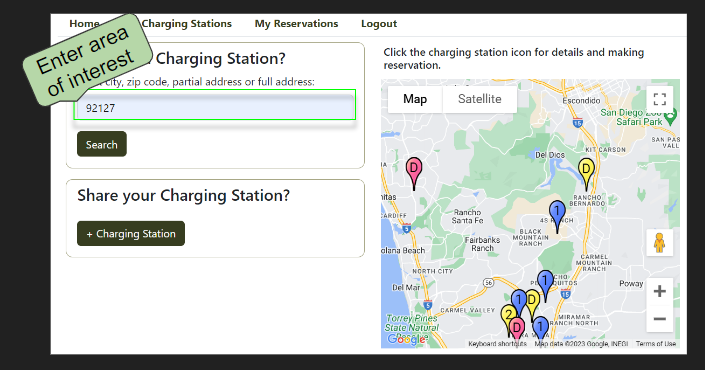

# Project-2
PROJECT #2

# Project Description
This app  allows owners of private home chargers to rent out their personal EV chargers to others by location, reservations, and duration of use with an owner fixed rate.
 
# Table of Contents
* [User Story](#User-Story)
* [How to Use this Project and Acceptance Criteria](#How-to-Use-this-Project-and-Acceptance-Criteria) 
* [Motivation for Development](#Motivation-for-Development) 
* [Features](#Features)
* [Process](#Process) 
* [Technology](#Technology) 
* [Tasks and Roles](#Tasks-and-Roles) 
* [Challenges](#Challenges) 
* [Successes](#Successes) 
* [Demo](#Demo) 
* [Directions for Future Development](#Directions-for-Future-Development) 
* [Support](#Support) 
* [Credits](#Credits) 
* [Contributors](#Contributors) 

# User-Story 
- AS A developer who 
- I WANT a EV Charge N Go site
- SO THAT electric car drivers can rent charging stations

# How to Use this Project and Acceptance Criteria
- GIVEN a EV Charge N Go Site
- WHEN I visit the site for the first time
- THEN I am presented homepage, which includes a map and a zip code form to enter your zip code
- WHEN I enter my zip code
- THEN I am prompted to sign up or login in
- WHEN I sign up 
- THEN I must provide an valid email address and password
- WHEN I am done signing up
- THEN I am automatically directed to my profile page
- WHEN I am logged in
- THEN I can add a charging startion OR make a reservation
- WHEN I add a charging station
- THEN I have to fill out the station form
- WHEN I make a reservation
- THEN I have to fill out the reservation form
- WHEN I made the reservation
- THEN I go to My Reservations
- WHEN
- THEN
- WHEN 
- THEN 
- WHEN 
- THEN 
- WHEN
- THEN
- WHEN 
- THEN 
- WHEN 
- THEN 
- WHEN
- THEN
- WHEN 
- THEN 
- WHEN 
- THEN 
- WHEN
- THEN
- WHEN 
- THEN 
- WHEN 
- THEN 
- WHEN
- THEN
- WHEN 
- THEN 

# Motivation for Development
- We all came to an agreement that 

# Features

# Process
- Topic
- Split up the work 

## Technology
- Trello
- HTML
- CSS3
- Vanilla Javascript
- Handlebars
- Heroku

## Tasks and Roles
<!-- - Hannah Chung: login.js, logout.js, signup.js, login.handlebars, signup.handlebars, myReservations.js, reservationRoutes.js, homeRoutes.js, userRoutes.js, homepage.js, reservation.js, main.handlebars, myReservations.handlebars, newReservation.handlebars, reservation.handlebars, helpers.js
- Heidi Wu: Google API, homeRoutes.js, userRoutes.js, login.js, logout.js, signup.js, css, userData.json, login.handlebars, signup.handlebars, stationData.json, seed.js
- Triana Deguzman: reservation.handlebars,reservation.js, homeRoutes.js, userRoutes.js, reservationData.json, userData.json
- Fernando Maldonado: homeRoutes.js, userRoutes.js, newStations.handelbars,myStation.handlebars
- Everyone: db and models
- README: Hannah
- Presentation slides: Triana and Hannah -->

## Challenges
<!-- trim error -- making a reservation-->
- reseration.js 
<!-- reserve a length of reservation -->
- duration 
- rendering registration 
- correct station id wasn't showing

## Successes 

## Demo

screenshots and video below 

# Directions for Future Development

## Short Term Goals 
- Comment section
- Ability to delete prior reservations
- Start and finish time reservation 
- Calendar view for station 

## Long Term Goals
- Station Reviews
- Send welcome email to user
- Ability to chat with owner
- Filter options such as price, charger types, etc. 

# Usage

The following screenshots show examples of the interaction and options presented to the user when application is initiated. 

Homepage:

Searching:

In order to make a reservation, click on the "Reserve Station" as seen in image:

Required Login to make new reservation(s) or register a new charging station: 

Detail Reservation: 

Viewing User Reservation(s) "My Reservations": 

- If no reservations have been made by the user the following will appear: 

Viewing User Charging Stations "My Charging Stations": 

Registering a new charging station: 

Logout: 

# Support
If you need support or have any questions about the repo, please [open an issue](https://github.com/hannybear88/-Project-2-EV-Charge-N-Go/issues) or contact us via email at evchargengo.p2@gmail.com. 

<!-- You can find more of our work on our GitHub, [hannybear88](https://github.com/hannybear88/), [heidiwu3388](https://github.com/heidiwu3388), [TrianaD](https://github.com/TrianaD), [fmaldmed](https://github.com/fmaldmed). -->

# Credits

- Hannah Chung
- Heidi Wu
- Triana Deguzman
- Fernando Maldonado

# Contributors

- Hannah Chung
- Heidi Wu
- Triana Deguzman
- Fernando Maldonado