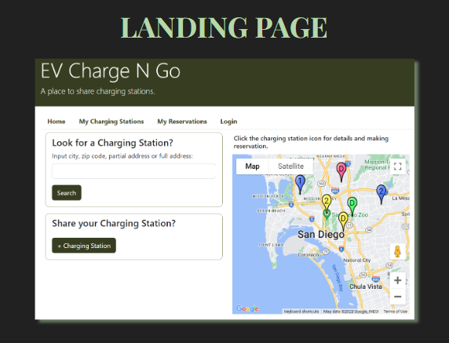
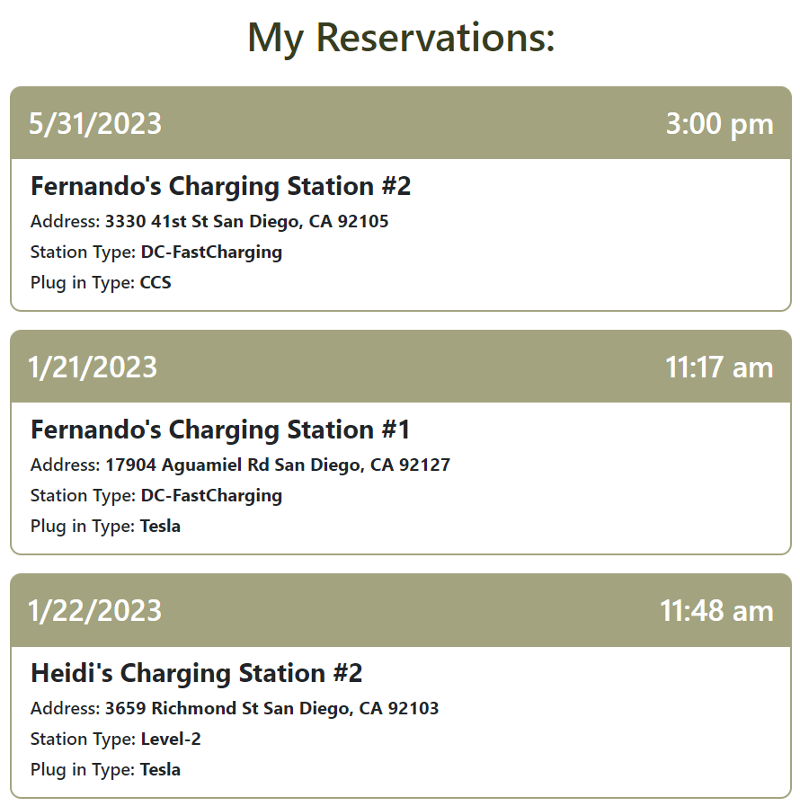
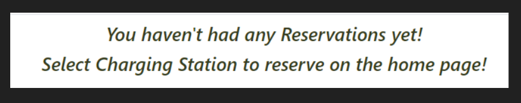

# Project-2
PROJECT #2

# Project Description
This app  allows owners of private home chargers to rent out their personal EV chargers to others by location, reservations, and duration of use with an owner fixed rate.
 
# Table of Contents
* [User Story](#User-Story)
* [How to Use this Project and Acceptance Criteria](#How-to-Use-this-Project-and-Acceptance-Criteria) 
* [Motivation for Development](#Motivation-for-Development) 
* [Features](#Features)
* [Process](#Process) 
* [Technology](#Technology) 
* [Tasks and Roles](#Tasks-and-Roles) 
* [Challenges](#Challenges) 
* [Successes](#Successes) 
* [Demo](#Demo) 
* [Directions for Future Development](#Directions-for-Future-Development) 
* [Support](#Support) 
* [Credits](#Credits) 
* [Contributors](#Contributors) 

# User-Story 
- AS A developer who is interested in supporting Californias initiative towards more electric vehicles
- I WANT an EV Charge N Go site to support the efforts in reducing gas emmissions and increasing electric vehicle use 
- SO THAT more individuals can have access to owning or using an electric car regardless of installing a home charger themselves or needing to own a home to access 
- AND SO THAT while traveling out of town, finding stations to reserve in advance to ensure the ability of electric vehicle use 
- WITHOUT obstacles from conveniences

# How to Use this Project and Acceptance Criteria
- GIVEN a EV Charge N Go Site
- WHEN I visit the site for the first time
- THEN I am presented homepage, which includes a map and a zip code form to enter your zip code
- WHEN I enter my zip code
- THEN I am prompted to sign up or login in
- WHEN I sign up 
- THEN I must provide an valid email address and password
- WHEN I am done signing up
- THEN I am automatically directed to the home page
- WHEN I am logged in and my username appears on the top right side of the home page
- THEN I can add a charging startion OR make a reservation
- WHEN I add a charging station
- THEN I have to fill out the station form
- WHEN I make a reservation
- THEN I have to fill out the reservation form
- WHEN I made the reservation
- THEN I go to My Reservations
- WHEN I go to My Reservations
- THEN all my reservations appear with detail station information, along with date and time of reservation
- WHEN I go to My Charging Stations
- THEN all the charging stations I own will appear in one page
- WHEN 
- THEN 
- WHEN
- THEN

# Motivation for Development
- We all came to an agreement that EV Charging isnt easily accessible and a gap for EV owners and station owners exists. Therefore allowing owners of stations to rent out home stations and also supporting EV drivers to a wider range of charging access better supports the future mission.  

# Features

# Process
- Topic / Project defined
- Defined a high level breakdown of the project
- Worked together creating the models
- Models helped define the various work packages and tasks required to complete the project
- Assigned tasks to team members
- Lots of collaboration throughout
    - working together via zooms, meetings, slack, etc to help with suo coding and/or brainstorming how to effectively move ahead in the process

## Technology
- Trello was used to help define tasks, schedule, and ownership throughout the different phases of the project.
- HTML
- CSS3
- Vanilla Javascript
- Handlebars
- Heroku

## Tasks and Roles
<!-- - Hannah Chung: login.js, logout.js, signup.js, login.handlebars, signup.handlebars, myReservations.js, reservationRoutes.js, homeRoutes.js, userRoutes.js, homepage.js, reservation.js, main.handlebars, myReservations.handlebars, newReservation.handlebars, reservation.handlebars, helpers.js
- Heidi Wu: Google API, homeRoutes.js, userRoutes.js, login.js, logout.js, signup.js, css, userData.json, login.handlebars, signup.handlebars, stationData.json, seed.js
- Triana Deguzman: reservation.handlebars,reservation.js, homeRoutes.js, userRoutes.js, reservationData.json, userData.json
- Fernando Maldonado: homeRoutes.js, userRoutes.js, newStations.handelbars,myStation.handlebars
- Everyone: db and models
- README: Hannah and Triana
- Presentation slides: Triana and Hannah -->

## Challenges
<!-- trim error -- making a reservation-->
- reseration.js 
<!-- reserve a length of reservation -->
- duration 
- rendering registration 
- correct station id wasn't showing

## Successes 

- Connecting Google API to application 
- Connecting the logged in user to their reservations while also displaying station information
- Having various icon types for different plug in and level type chargers registered
- Defining the flow and linkages between the various stages 
- Connecting the station registration 

## Demo

Screenshots of application usage along with links to deployed site below. 

# Directions for Future Development

## Short Term Goals 
- Comment section
- Ability to delete prior reservations
- Start and finish time reservation 
- Calendar view for station 

## Long Term Goals
- Station Reviews
- Send welcome email to user
- Ability to chat with owner
- Filter options such as price, charger types, etc. 

# Usage

The following screenshots show examples of the interaction and options presented to the user when application is initiated. 

Homepage:

Searching:

Below shows the key to the map and what the different icons/numbers represent in the map:

In order to make a reservation, click on the "Reserve Station" as seen in image:

Required Login to make new reservation(s) or register a new charging station: 

If no account has been created, a signup option is available on the bottom of the login where the sign up page will appear: 

Detail Reservation: 

Viewing User Reservation(s) "My Reservations": 

- If no reservations have been made by the user the following will appear: 

Viewing User Charging Stations "My Charging Stations": 

Registering a new charging station: 

Logout: 

# Support
If you need support or have any questions about the repo, please [open an issue](https://github.com/hannybear88/-Project-2-EV-Charge-N-Go/issues) or contact us via email at evchargengo.p2@gmail.com. 

<!-- You can find more of our work on our GitHub, [hannybear88](https://github.com/hannybear88/), [heidiwu3388](https://github.com/heidiwu3388), [TrianaD](https://github.com/TrianaD), [fmaldmed](https://github.com/fmaldmed). -->

# Credits

- Hannah Chung
- Heidi Wu
- Triana Deguzman
- Fernando Maldonado

# Contributors

- Hannah Chung
- Heidi Wu
- Triana Deguzman
- Fernando Maldonado